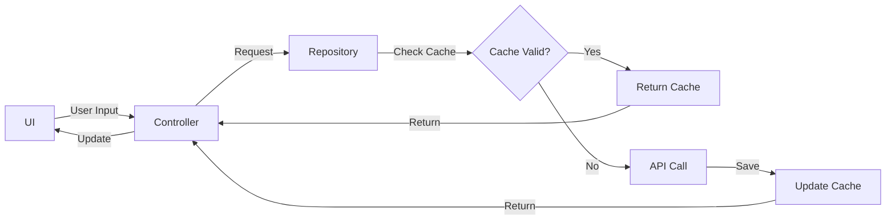

# 💱 FXNow - Application de Conversion de Devises


---

## 📱 Description

**FXNow** est une application mobile Flutter moderne qui permet de convertir instantanément des montants entre plus de 30 devises internationales. Utilisant l'API gratuite Frankfurter (données de la BCE), elle offre des taux de change actualisés avec une interface intuitive et élégante.

### ✨ Points Forts

- 🚀 **Conversion instantanée** - Résultats en temps réel
- 🎨 **Design moderne** - Material Design 3 avec thèmes clair/sombre
- 📱 **Interface intuitive** - Clavier personnalisé et animations fluides
- 🌍 **Multi-langue** - Français & Anglais (extensible)
- 💾 **Mode hors ligne** - Cache intelligent pour utilisation sans Internet
- 🔄 **Swap rapide** - Inversion des devises en un tap
- 📊 **32+ devises** - Support des principales devises mondiales

---

## 🎥 Aperçu

### Fonctionnalités Principales

## 🚀 Installation Rapide

### Prérequis

Avant de commencer, assurez-vous d'avoir :

- ✅ **Flutter SDK** : Version 3.0.0 ou supérieure
  ```bash
  flutter --version  # Vérifier la version installée
  ```
- ✅ **IDE** : Android Studio, VS Code ou IntelliJ IDEA
- ✅ **Émulateur** : Android/iOS ou appareil physique
- ✅ **Git** : Pour cloner le repository

### Étapes d'Installation

#### 1️⃣ Cloner le Repository

```bash
git clone https://github.com/Junior620/currency-change.git
cd currency-change
```

#### 2️⃣ Installer les Dépendances

```bash
flutter pub get
```

#### 3️⃣ Générer les Fichiers (Optionnel)

```bash
# Générer les fichiers de localisation
flutter gen-l10n

# Générer les fichiers Hive/JSON (si nécessaire)
flutter pub run build_runner build --delete-conflicting-outputs
```

#### 4️⃣ Lancer l'Application

```bash
# Sur l'émulateur par défaut
flutter run

# Sur un appareil spécifique
flutter devices              # Lister les appareils
flutter run -d <device-id>   # Lancer sur l'appareil choisi

# En mode release
flutter run --release
```

### 🎯 Vérification de l'Installation

Si tout fonctionne correctement, vous devriez voir :
```
✓ Built build/app/outputs/flutter-apk/app-debug.apk
Launching lib/main.dart on <device> in debug mode...
```

---

## 🏗️ Architecture du Projet

### 📁 Structure des Dossiers

```
lib/
├── main.dart                              # 🚪 Point d'entrée
│
├── l10n/                                  # 🌍 Internationalisation
│   ├── app_localizations.dart             # Classe générée
│   ├── app_localizations_en.dart          # 🇬🇧 Anglais
│   └── app_localizations_fr.dart          # 🇫🇷 Français
│
└── src/
    ├── app/                               # ⚙️ Configuration
    │   ├── app.dart                       # Widget racine MaterialApp
    │   └── theme/
    │       └── themes.dart                # 🎨 Thèmes clair/sombre
    │
    ├── core/                              # 🔧 Utilitaires
    │   ├── env/
    │   │   └── env.dart                   # Variables d'environnement
    │   ├── errors/
    │   │   └── failures.dart              # Gestion d'erreurs typée
    │   └── utils/
    │       ├── extensions.dart            # Extensions Dart
    │       └── formatters.dart            # Formatage i18n
    │
    ├── data/                              # 💾 Couche de données
    │   ├── api/
    │   │   └── rates_api.dart             # Client HTTP Frankfurter
    │   ├── cache/
    │   │   └── cache_service.dart         # Cache local (SharedPreferences)
    │   ├── models/
    │   │   ├── currency.dart              # Modèle de devise
    │   │   ├── currency_data.dart         # Base de données des devises
    │   │   ├── exchange_rate.dart         # Modèle de taux
    │   │   └── rate_point.dart            # Point d'historique
    │   ├── providers/
    │   │   └── providers.dart             # Providers Riverpod
    │   └── repositories/
    │       └── rates_repository.dart      # Repository avec cache
    │
    ├── features/                          # 🎯 Fonctionnalités
    │   └── converter/                     # Module de conversion
    │       ├── controllers/
    │       │   └── converter_controller.dart  # Logique métier
    │       ├── ui/
    │       │   └── converter_page.dart        # Interface principale
    │       └── widgets/
    │           ├── calculator_keypad.dart     # Clavier personnalisé
    │           ├── currency_selector.dart     # Sélecteur de devise
    │           └── result_display.dart        # Affichage résultat
    │
    └── router/
        └── routes.dart                    # 🧭 Navigation GoRouter
```

### 🏛️ Architecture en Couches (Clean Architecture)

```
┌─────────────────────────────────────────────┐
│  UI LAYER (Presentation)                    │
│  • Pages (converter_page.dart)              │
│  • Widgets (calculator, selector, display)  │
│  • Controllers (converter_controller.dart)  │
├────────��────────────────────────────────────┤
│  DOMAIN LAYER (Business Logic)              │
│  • Models (ExchangeRate, Currency)          │
│  • Failures (NetworkFailure, etc.)          │
├─────────────────────────────────────────────┤
│  DATA LAYER (Data Sources)                  │
│  • Repository (rates_repository.dart)       │
│  • API Client (rates_api.dart)              │
│  • Cache Service (cache_service.dart)       │
└─────────────────────────────────────────────┘
```

### 🔄 Flux de Données



---

## 🛠️ Technologies Utilisées

### 🎯 Stack Technique

| Catégorie | Technologie | Version | Utilisation |
|-----------|-------------|---------|-------------|
| **Framework** | Flutter | 3.0+ | UI multi-plateforme |
| **Langage** | Dart | 3.0+ | Logique métier |
| **State Management** | Riverpod | ^2.5.1 | Gestion d'état réactive |
| **Navigation** | GoRouter | ^14.2.0 | Navigation déclarative |
| **HTTP Client** | Dio | ^5.4.3 | Requêtes API |
| **Cache** | SharedPreferences | ^2.2.3 | Persistance locale |
| **i18n** | Intl | ^0.20.2 | Internationalisation |
| **Animations** | Flutter Animate | ^4.5.0 | Animations fluides |
| **Utils** | Equatable | ^2.0.5 | Comparaison d'objets |
| **Icons** | Material Icons | - | Icônes Material Design |

### 🌐 API Externe

**[Frankfurter API](https://www.frankfurter.app/)** - API gratuite de taux de change
- 💰 **Gratuit** sans limite de requêtes raisonnable
- 📊 **Source** : Banque Centrale Européenne (BCE)
- 🔄 **Mise à jour** : Quotidienne
- 📚 **Documentation** : https://www.frankfurter.app/docs/

---

## 💻 Utilisation

### Conversion Basique

1. **Sélectionner la devise source** (ex: USD 🇺🇸)
2. **Sélectionner la devise cible** (ex: EUR 🇪🇺)
3. **Saisir le montant** avec le clavier personnalisé
4. **Résultat instantané** affiché en temps réel

### Fonctionnalités Avancées

#### 🔄 Inverser les Devises
Appuyez sur le bouton **Swap** (⇄) pour inverser instantanément les devises.

#### 📋 Copier le Résultat
Appuyez sur le bouton **Copier** pour mettre le résultat dans le presse-papiers.

#### 📤 Partager le Résultat
Appuyez sur le bouton **Partager** pour envoyer le résultat via d'autres applications.

#### 🔍 Rechercher une Devise
Utilisez la barre de recherche dans le sélecteur pour trouver rapidement une devise.

#### 🌙 Changer de Thème
Le thème suit automatiquement les préférences système (clair/sombre).

---

## 🎨 Personnalisation

### Ajouter une Nouvelle Devise

Modifiez `lib/src/data/models/currency_data.dart` :

```dart
static const Map<String, Map<String, String>> currencies = {
  // ...existing currencies...
  'BTC': {'name': 'Bitcoin', 'flag': 'assets/flags/btc.png'},
};
```

### Modifier les Couleurs du Thème

Éditez `lib/src/app/theme/themes.dart` :

```dart
class AppColors {
  static const primary = Color(0xFF4F46E5);    // Indigo
  static const secondary = Color(0xFF22C55E);  // Vert
  // ...
}
```

### Changer l'URL de l'API

Modifiez `lib/src/core/env/env.dart` :

```dart
class Env {
  static const String apiBaseUrl = 'https://votre-api.com';
}
```

### Ajouter une Nouvelle Langue

1. Créez `l10n/intl_es.arb` (pour l'espagnol par exemple)
2. Ajoutez les traductions
3. Mettez à jour `l10n.yaml` :
   ```yaml
   arb-dir: l10n
   template-arb-file: intl_en.arb
   output-localization-file: app_localizations.dart
   ```
4. Ajoutez dans `app.dart` :
   ```dart
   supportedLocales: const [
     Locale('en'),
     Locale('fr'),
     Locale('es'), // Nouveau
   ],
   ```
5. Regénérez : `flutter gen-l10n`

---

## 🧪 Tests

### Lancer les Tests

```bash
# Tous les tests unitaires
flutter test

# Tests avec couverture
flutter test --coverage

# Tests spécifiques
flutter test test/features/converter/converter_controller_test.dart
```

### Structure des Tests

```
test/
├── features/
│   └── converter/
│       ├── converter_controller_test.dart
│       └── widgets/
│           └── calculator_keypad_test.dart
├── data/
│   ├── repositories/
│   │   └── rates_repository_test.dart
│   └── api/
│       └── rates_api_test.dart
└── mocks.dart
```

---

## 📦 Build et Déploiement

### Android

#### APK Debug (Pour tests)
```bash
flutter build apk --debug
# Fichier généré: build/app/outputs/flutter-apk/app-debug.apk
```

#### APK Release (Pour distribution)
```bash
flutter build apk --release
# Fichier généré: build/app/outputs/flutter-apk/app-release.apk
```

#### App Bundle (Pour Google Play)
```bash
flutter build appbundle --release
# Fichier généré: build/app/outputs/bundle/release/app-release.aab
```

### iOS (macOS uniquement)

```bash
flutter build ios --release
# Ouvrir ensuite Xcode pour archiver et uploader
```

---

## 🐛 Dépannage

### Problèmes Courants

#### ❌ Erreur: "SDK location not found"
```bash
# Créer local.properties dans android/
echo "sdk.dir=/chemin/vers/Android/Sdk" > android/local.properties
```

#### ❌ Erreur: "Failed to resolve: com.google.android.material"
```bash
flutter clean
flutter pub get
```

#### ❌ Erreur: "No devices found"
```bash
# Vérifier les appareils disponibles
flutter devices

# Lancer un émulateur
flutter emulators
flutter emulators --launch <emulator_id>
```

#### ❌ Taux de change non actualisés
- Vérifier la connexion Internet
- Vider le cache : Paramètres > Apps > FXNow > Effacer les données

#### ❌ Application lente
```bash
# Compiler en mode release
flutter run --release
```

---

## 📚 Documentation

### Documentation Complète

Consultez `DOCUMENTATION_COMPLETE.md` pour :
- Architecture détaillée
- Explication des patterns utilisés
- Guide de contribution
- Bonnes pratiques

### Ressources Utiles

- 📘 [Documentation Flutter](https://flutter.dev/docs)
- 📗 [Documentation Riverpod](https://riverpod.dev/)
- 📙 [Documentation GoRouter](https://pub.dev/packages/go_router)
- 📕 [API Frankfurter](https://www.frankfurter.app/docs/)

---

#### Commits
Format : `Type: Description`
- `Add:` Nouvelle fonctionnalité
- `Fix:` Correction de bug
- `Refactor:` Refactoring du code
- `Docs:` Documentation
- `Style:` Formatage du code
- `Test:` Ajout de tests

---

## 📋 Roadmap

### Version Actuelle (1.0.0) ✅
- [x] Conversion de devises en temps réel
- [x] Support de 32 devises
- [x] Mode clair/sombre
- [x] Internationalisation (EN/FR)
- [x] Cache local

### Prochaines Versions 🚀

#### v1.1.0 (En cours)
- [ ] Graphiques d'évolution des taux
- [ ] Favoris de devises
- [ ] Widget home screen
- [ ] Mode offline amélioré

#### v1.2.0 (Planifié)
- [ ] Calculatrice de pourboire
- [ ] Conversion multiple simultanée
- [ ] Export PDF des conversions
- [ ] Support d'autres APIs

-

</div>
